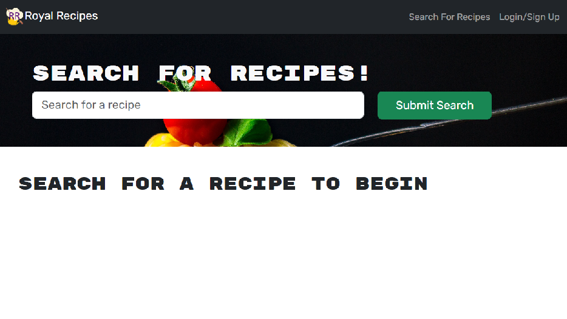
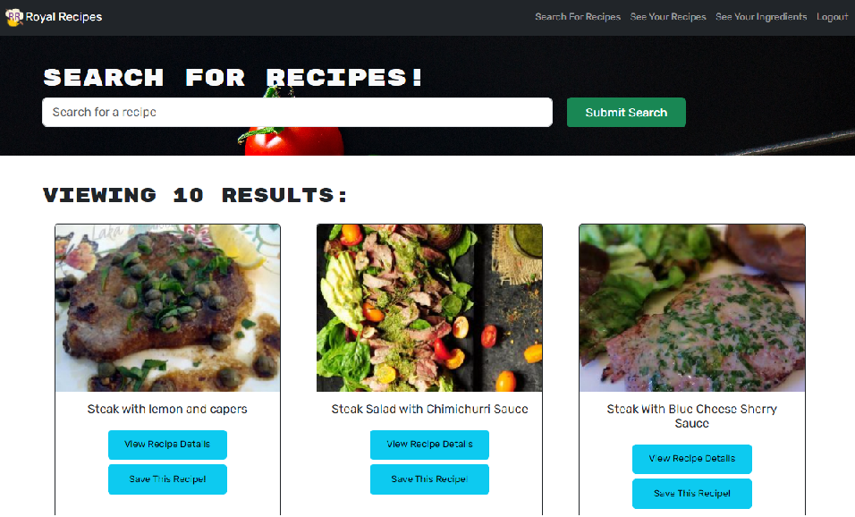
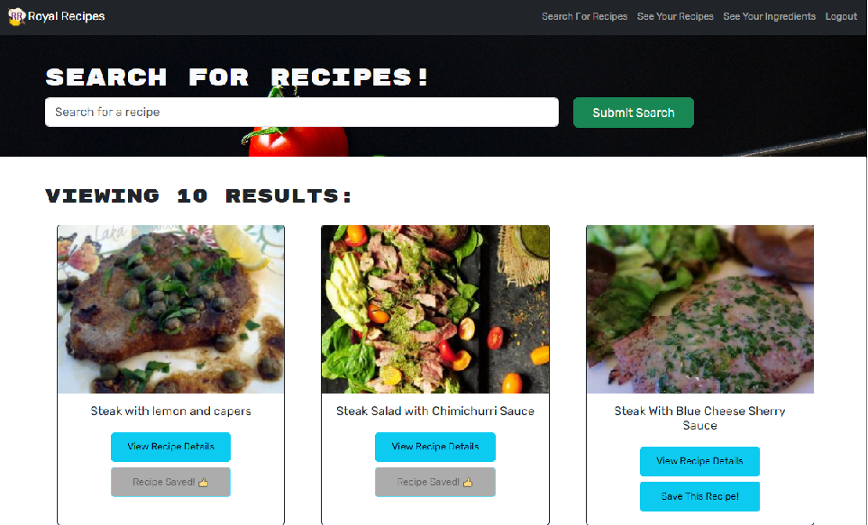
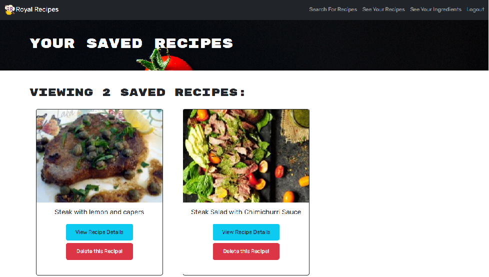
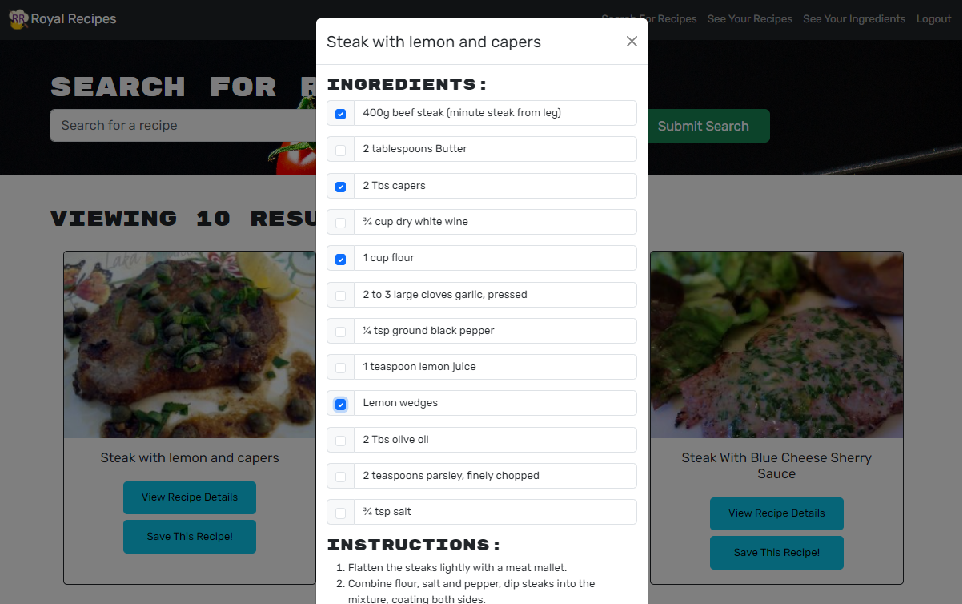
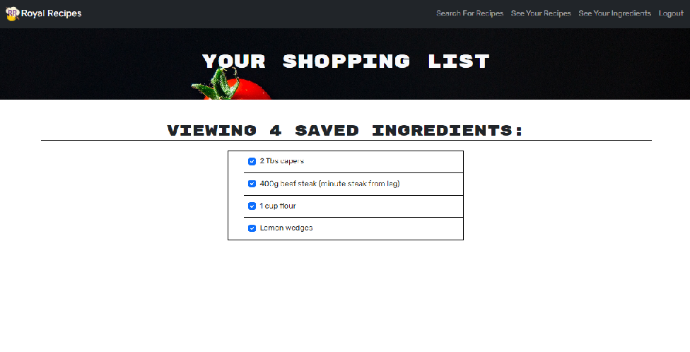

# ROYAL RECIPES 

## Description 
Have you ever been at the grocery store trying to decide what meals you’d like to make for the week, and then fumbling through multiple different recipes to look through their ingredients lists to see what you need?
Royal Recipes is a meal-planner type application where you can plan out your meals by saving recipes you’ve searched and adding the ingredients in the recipe to your shopping list! 
Now you’ve got all your recipes saved to one place, and a list of the ingredients you’ve need to make your shopping trip a breeze! 

In its early development, it offers users the ability to save recipes they've chosen through the Spoonacular API and the ability to create a customized shopping list for the ingredients they'll need to get! Users will be able to select specific ingredients from the recipe, so this takes into account that many people already have staples at home they don't need to shop for and thus don't need to full list of ingredients saved to their lists.  

In its entirety, Royal Recipes hopes to become a full meal-planner and grocery-delivery application! 
This would include features such as: 
- a calendar so the user can plan out what recipes they'd like to cook and when
- connection to a grocery-delivery feature, where the ingredients needed to make the selected recipes will be sent to the user
	- can be set up on a weekly basis, or used whenever

## The Current Goal
```
- To create a recipe website which allows you to search any recipes you may be interested in.
- upon clicking on a chosen recipe it provides you with a breakdown of the ingredients and a guide to creation.
- ability to login/signup - when logged in the ability to logout
- when logged in you have the ability to save your recipe in the "Saved Recipe" section of the webpage.
- When in the "Saved Recipe" section of the webpage you can view your recipes as well as delete them if wanted.
- save user data to db (mongo atlas)
```

## Table of Contents 
- [Deployment](#deployment)
- [Usage](#usage)
- [Contributors](#contributors-and-questions)
- [Test](#test)
- [License](#license)

## Deployment


## Usage

  
Landing Page.  Allows user to search for recipes. Users must sign in to save recipes and ingredients. 

  
Upon logging in, user will have additional navigation tabs to 'See Your Recipes' where they can find recipes they've saved, and a 'See your Ingredients' where they will find the shopping list they've made.

  
  
Upon clicking the 'Save This Recipe!' button, users are able to save the recipes they want, which will be added to their 'See Your Recipes' page

  
    
Upon clicking the 'View Recipe Details' button, a list of the recipe's ingredients, as well as instructions will pop up. The user can interact with the ingredients list by clicking the checkboxes to add ingredients to their 'See Your Ingredients' page, thus creating a shopping list! User can clear ingredients off their shopping list by clicking on the check.  

## Contributors
=- [Boris Cabrera](https://github.com/boro101094/)
- [Joyce Chan](https://github.com/jaychan0125/)
- [Austin Grech](https://github.com/AustinGrech/)
- [Jef Ogues](https://github.com/jef1197/)

## License
Licensed under the [MIT License](https://opensource.org/licenses/MIT)

